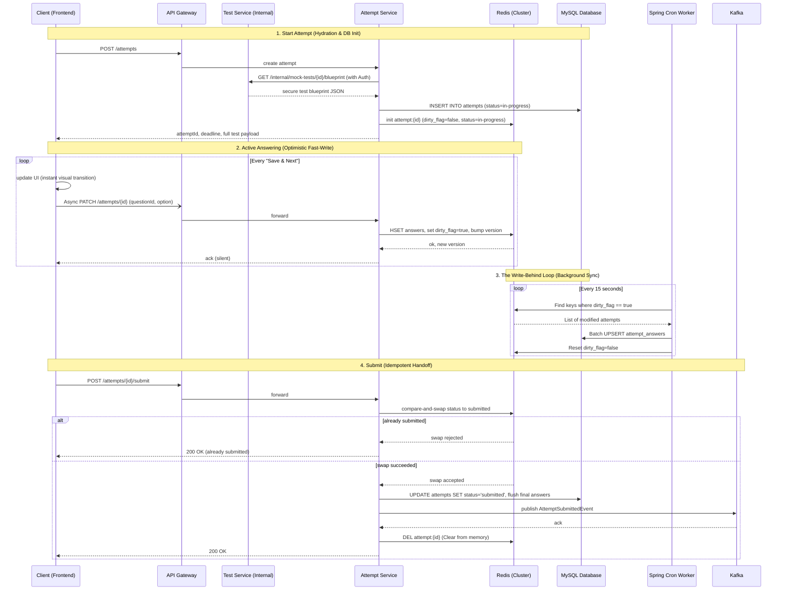

# Attempt Service Architecture Design

**Component:** Exam Engine (`attempt-service`)
**Architecture Pattern:** Write-Behind Cache (Redis as shock-absorber, MySQL as persistent system of record)
**Scope:** Live test-taking sessions — from attempt start through submission, including background state synchronization.
**Out of Scope:** Grading, analytics, and question content authoring.

---

## 1. Purpose

The attempt service owns the lifecycle of a single student's test attempt. It implements the **Upfront Hydration** and **Write-Behind Synchronization** patterns to optimize for two critical requirements: zero-latency visual transitions for the student during high-concurrency exam windows, and absolute resilience against data loss or network dead zones. By decoupling real-time writes from relational database constraints, it protects the core infrastructure while ensuring eventual consistency and durability.

## 2. Lifecycle

```text
start → in-progress → submitted
                  ↘ expired (TTL lapse, no submit)

```

Once an attempt reaches `submitted` or `expired`, it is terminal. No further writes are accepted, and the state is handed off to the evaluation ecosystem.

## 3. Dual-Layer Data Model

The state is split between a fast-write volatile layer and a persistent relational layer to balance speed with durability.

### Layer A: Redis (The Active Fast-Write Layer)

Used strictly for active, `in-progress` exams. One hash per attempt, keyed by attempt ID, with a TTL set to the exam duration plus a grace buffer.

```text
attempt:{attemptId} (Hash)
  userId: "user-123"
  examId: "m4n5p6..."
  startedAt: "1711200000"
  durationSec: 10800
  status: "in-progress"
  dirty_flag: "true"          // Critical for Write-Behind worker
  currentQuestionIndex: 4
  answers: '{"q1": "B", "q2": "A"}' 
  version: 4                  // Increments on every write for optimistic locking

```

### Layer B: MySQL (The Persistent Record Layer)

Used for durability, crash recovery, and historical records.

* **Table `attempts**`: `id`, `user_id`, `test_id`, `started_at`, `duration_minutes`, `status`
* **Table `attempt_answers**`: `attempt_id`, `question_id`, `selected_option`, `updated_at`

## 4. API Surface

| Endpoint | Method | Purpose |
| --- | --- | --- |
| `/attempts` | `POST` | Start an attempt. Provisions DB/Redis records, fetches the test blueprint securely via internal API, and returns the attempt ID, deadline, and the full test payload (Upfront Hydration). |
| `/attempts/{id}` | `GET` | Fetch current state. Used for crash recovery and reconnects to re-hydrate the frontend. |
| `/attempts/{id}` | `PATCH` | Apply one state change (answer, flag). Requires `version`. Fire-and-forget from the client. Hits Redis only. |
| `/attempts/{id}/stream` | `GET` | Establish a Server-Sent Events (SSE) connection for active connection health monitoring and server-side alerts. |
| `/attempts/{id}/submit` | `POST` | Finalize the attempt. Flushes final state to DB, publishes to Kafka, and clears Redis. |

*Note: `PATCH` and `submit` validate the server-side deadline before accepting any write.*

## 5. Full Lifecycle Sequence

This sequence covers upfront hydration, the optimistic asynchronous saving loop, background synchronization, and the idempotent submit handoff.



## 6. Timing & Security Enforcement

* **Server-Side Source of Truth:** The client-side countdown timer is cosmetic. Every `PATCH` checks `now < startedAt + durationSec` on the server before accepting the write.
* **Internal Security:** The attempt service uses an internal Feign client equipped with the `X-Internal-Auth` secret to securely retrieve answer keys from the `test-service`. It never exposes these keys to the frontend.
* **Gateway Sanitization:** The architecture relies on the API Gateway to strip unauthorized `X-User-Role` and `x-user-id` headers from incoming internet traffic, replacing them with verified claims from the JWT.

## 7. Scaling and Failure Modes

* **Stateless Engine Nodes:** All session state lives in Redis and MySQL. No sticky sessions are required. The engine scales horizontally behind the API Gateway.
* **Redis Container Crash:** If Redis goes down, the system reads the last known state from the MySQL `attempt_answers` table to rebuild the Redis hash upon the student's next request. The student only loses, at most, the few seconds of data that hadn't yet been flushed by the Write-Behind worker.
* **MySQL Connection Pool Exhaustion:** Database slowdowns will not affect active test-takers. The Spring Cron worker will simply take longer to flush the queue, while Redis continues to serve the real-time "Save & Next" traffic flawlessly.
* **Offline Tolerance (Sync Queue):** If a student hits a network dead zone, the frontend catches the `PATCH` failure, caches the payloads locally (e.g., in IndexedDB), and allows the student to continue answering. Upon SSE stream reconnection, the frontend flushes the offline queue in a bulk update.
* **Zombie Sessions (Expiry Auto-Flush):** If a student closes their browser and never submits, the exam must still be graded. A Spring listener (or lightweight poller) catches the expired timeframe, triggers a final MySQL flush, sets the DB status to `expired`, and fires the `AttemptSubmittedEvent` to Kafka.

## 8. Explicit Non-Goals

* **Grading & Analytics:** Owned entirely by the Evaluation service, which acts as a downstream consumer of the `AttemptSubmittedEvent`.
* **Question Content and Structure Authoring:** Owned purely by the `test-service`. The attempt service stores only the student's volatile responses and fetches the blueprint securely at runtime.